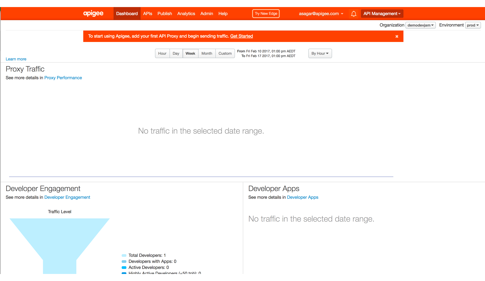

# Apigee Edge Advanced DevJam
Welcome to the Apigee Edge advanced hands on DevJam workshop.

# Getting Started

In this workshop, you will get first hand exposure to Apigee Edge, the full featured enterprise API Management platform. To get started with Apigee Edge, you will need to get access to an Apigee instance. 

  If you're new to Apigee, visit this page to create an account: <a href="https://apigee.com/edge" target="_blank">https://apigee.com/edge</a>.
  
  If you already have Apigee Edge account on cloud, You can skip create account part.

  You will be presented with a sign in form as shown here:
  

Select the _Create Account_ option. This will direct you to this registration form:

   

  Fill in your information and select _Create account_ to submit your registration information. In a few minutes you will receive an email from Apigee with an email verification link:

  
  
Once your account has been created, you need to be added to the Apigee environment we'll be using today. To get added, go to:

## [https://devjam-addmetoorg.appspot.com/](https://devjam-addmetoorg.appspot.com/)

  

  Enter your email address & click on Add me to DevJam Org button. On success, It should add you to the Apigee Edge instance we'll be using today and redirect you to the Apigee Edge UI. Login to access Apigee Edge UI:

  

  Once you are successfully in the Apigee Edge UI, make sure you are in the correct Apigee organization. For the session, you should be in demo-au04. 
  
  
  
Click on "SWITCH TO CLASSIC" link on side navigator bar to switch to classic Edge UI.

  
  
 You should now see Classic Edge UI.

   
 
 You are now ready to get started on the labs.
 
 
  
# Hands on Labs

1. [API Development : API Proxy Flows](lab1.md)
2. [API Development : Create a Mashup with APIs (Composite APIs) ](lab2.md)
3. [API Security : Threat Protection](lab3.md)
4. [API Performance: Caching - Populate, Lookup](lab4.md)
5. [Analytics - Create Custom Reports](lab3.md)
6. [OAuth - Client Credentials](lab5.md)
7. [OAuth - 3 Legged - Authorization Code](lab3.md)

