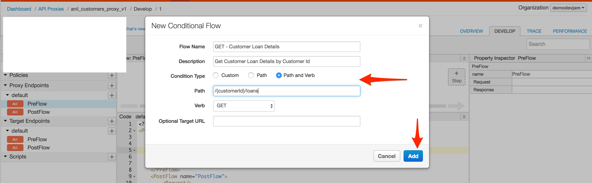
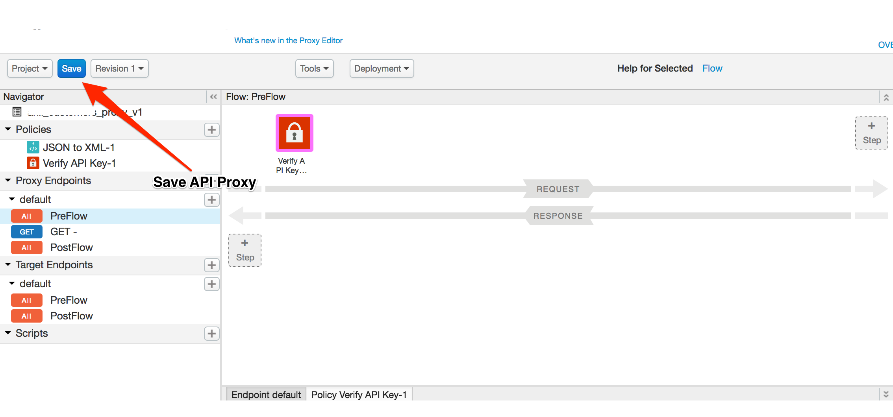

#  Lab 1 – Understanding Flows (Estimated Time - 45 minutes)

## Objectives

In this lab you will get familiar with the Apigee Edge Platform concept of API Proxy Flows. It's one of our developer favorite & most important functionality in Apigee Edge. Apigee Flows feature gives you flexibility to innovate with your API Design, Development & Control API Runtime flow.

In this lab we will see how to create a proxy, Add API resources (Conditional Flows), Add some policies that will be applicable to all the API resources inside the API Proxy, Add some polcies specific to certain endpoints, Reuse policies.

## Prerequisites

- Apigee Edge Account

## Introduction

As you have seen in DevJam Prerequisites labs, You can attach policies to either request or response flows in API Proxy. 

API proxies define request and response flows that are executed in a specific order. The order allows you to apply logic and behavior at specific points in the API proxy execution. The request and response flows are subdivided into proxy and target endpoints (We will learn more about proxy & target endpoints in next lab). Each segment is subdivided into the following flow 'stages':

- **PreFlow**: Always executes before any conditional flows.http://d3grn7b5c5cnw5.cloudfront.net/sites/docs/files/ProxyToBackendWithFlows_v3.png
- **Conditional flows**: One or more flows, each of which has an associated condition. Conditional flows tell Edge, "When you see this, perform this logic." For example, when an API call is a GET on the /movies resource (the condition), transform the response to JSON (through a policy attached to the conditional flow). Only one flow executes per transaction—the first flow whose condition evaluates to true.

	In a conditional flow, the condition is evaluated in both the request and response. You cannot have separate conditions for request and response.

- **PostFlow**: Always executes after any conditional flows. 
- **PostClientFlow**: An optional flow that executes after the response message has been sent to the requesting client app. (This is a specialized flow, and only MessageLogging policies can be attached to it.)

The following figure shows a basic request and response exchange between an app and a backend service. In this figure, the ProxyEndpoint and TargetEndpoint have been expanded to show the flows used to process the request and response: 

  
  
  This may look complicated, but it's fairly simple once you understand a few use cases.
  
## Part 1. Getting started with a proxy
  
  API Team got a requirement from business team to expose legacy "Customers API" with a new rest design & additional API features like security which will become APP developer friendly and eventually increase the consumption of backend services.
  
### Given Information :
  
  Backend URL : https://apibaas-trial.apigee.net/asagar/macquarie-demo01/customers

  
### Action Items :

 - Create a reverse pass through proxy with a name **{your_initials}\_customers\_proxy\_v1**
 - Base Path should be **/v1/{your_initials}-customers**
 - Deploy to test environment

### Success Criteria :
  
  - API Call to **https://{ORNAME}-test.apigee.net/v1/{your_initials}-customers** should return list of customers.

## Let's do it ! 

- Create a proxy in Apigee Edge UI. Navigate to APIs -> API Proxies
- Click on Create New Proxy button on top right sidebar.
- Use above information & experience you have gained from Apigee Edge DevJam Prerequisites labs that you have done prior to this DevJam.
- Have a question / questions ? Apigee Team is happy to help you. Please ask for help.

## Part 2. Introduction to conditional flows

We now got a new requirement from business team & more details related to target customer API from backend team. 

### Given Information :

- Customers API supports GET, POST, PUT, DELETE methods which will allow developers to Retrieve, Create, Update, Delete customers entities. 
- It also has an API to retrieve individual customer loan details using **https://apibaas-trial.apigee.net/asagar/macquarie-demo01/customers/{customerUUID}/loans** endpoint.

### Business Team Requirements :

- API Response of GET Individual customer loan details should be of XML format instead of JSON.
- API Response of other endpoints like get all customer details, get customer details, create customer, update customer, delete customer should be JSON as it is sent by the target server.

### Success Criteria :
  
  - API Call to **https://{ORNAME}-test.apigee.net/v1/{your_initials}-customers/{customerUUID}/loans** should return details in XML.
  - API Call to **https://{ORNAME}-test.apigee.net/v1/{your_initials}-customers/** should return details in JSON.

  
## Let's do it !

Add a conditional flow that get's executed when proxy path suffix matches '/{customerId}/loans' & http method is GET.

**Step 1**: Click on proxy you have created earlier, Click on Develop tab.

  
  
**Step 2** : Click on + icon next to Proxy EndPoints -> Defaults to add a conditonal flow to proxy endpoint.

  
  
**Step 3** : Add conditional flow by providing matching conditions for our requirement & click add. 

Clue: See image below

    

**Step 4** : Click on the conditional flow you have created, Add JSON-TO-XML policy to response flow.

  
    
    

**Step 5** : Save API Proxy.

## Time to verify !

**Step 1**: Call to API , **https://{ORG}-test.apigee.net/v1/{YOUR_INITIALS}-customers/2315a37b-f4b4-11e6-8477-122e0737977d/loans** should give response in XML.

**Step 2**: Call to API , **https://{ORG}-test.apigee.net/v1/{YOUR_INITIALS}-customers/2315a37b-f4b4-11e6-8477-122e0737977d** should give response in JSON.

**Step 3**: Call to API , **https://{ORG}-test.apigee.net/v1/{YOUR_INITIALS}-customers** should give response in JSON.

Congratualtions !! You have completed your first task & satisified your business team with great API Management skills.

## Part 2. Introduction to preflow & postflow :

Great, You are on your way to become an API Ninja. Your business team is ready to sharpen your API Management skills with a new requirement.

### Business Team Requirements :

- Secure all API calls to customers API using API Key security protection mechanism.

### Success Criteria :

  - API Call to **https://{ORNAME}-test.apigee.net/v1/{your_initials}-customers/{customerUUID}/loans** should return 403 with an error
  - API Call to **https://{ORNAME}-test.apigee.net/v1/{your_initials}-customers/{customerUUID}** should return 403 with an error
  - API Call to **https://{ORNAME}-test.apigee.net/v1/{your_initials}-customers/{customerUUID}** should return 403 with an error  

## Let's do it !

As you know preflow executes before conditional flow & post flow exectutes after conditional flow no matter what. It's more or less like below programming logic,

```
// preflow
var a = 2;
var b = 3;
checkDeveloperQuota();
// conditional flow

if (http_verb == 'GET' & path == '/{customerId}/loans') {
  addAdditionalPayload();
} else if (someOtherCondition1) {
  policyExecutes();
} else if (someOtherCondition2) {
  policyExecutes();
} else if (someOtherCondition3) {
  policyExecutes();
}
// postfow

  var c = 4;
  convertRequestFormatAfterAdditionalPayloadAddition();
```  


Before we start, We have a question from API Team Leader, Can you answer it ?

**Q : Where will you add "verifyApiKeyPolicy" to secure Customer related APIs ?**

* A) All conditional flows
* B) PostFlow
* C) PreFlow
* D) All of the above
* E) Any one of the above will work.


Let's implement the solution,

Step 1 : Click on PreFlow in API Proxy, Add 'verifyApiKey' policy to request flow.

    
    

Step 2 : Save the updated proxy.

    

## Time to verify !

  - API Call to **https://{ORNAME}-test.apigee.net/v1/{your_initials}-customers/{customerUUID}/loans** should return 403 with an error message
  - API Call to **https://{ORNAME}-test.apigee.net/v1/{your_initials}-customers/{customerUUID}** should return 403 with an error message
  - API Call to **https://{ORNAME}-test.apigee.net/v1/{your_initials}-customers/{customerUUID}** should return 403 with an error message

Congratualtions !! You have completed your second task & understood how flows concept works in Apigee Edge.


# For Extra Credit

### Business Team Requirements :

- Allow access to GET /customers , GET /customers/{customerId}/loans endpoints, disallow access to all other endpoints like POST, PUT, DELETE, GET /customers/{customerId}

- For other resources except allowed one, Respond with a custom error message saying no resource found.

Tip : See the solution [here](https://community.apigee.com/articles/4744/handling-invalid-resource-paths-using-a-default-re.html) & implement same for above customers proxy.  

## Time to verify Extra Credit task!

  - API Call to **https://{ORNAME}-test.apigee.net/v1/{your_initials}-customers/{customerUUID}/loans** should return 403 with an error message saying API key required.
  - API Call to **https://{ORNAME}-test.apigee.net/v1/{your_initials}-customers/** should return 403 with an error message saying API key required.
  - API Call to **https://{ORNAME}-test.apigee.net/v1/{your_initials}-customers/{customerUUID}** should return 404 not found with an error message saying resource not found.


## Summary

That completes this hands-on lesson. Simple and quick. You learned the fundamentals of understanding flows in Apigee Edge.

For more details refer, 

- http://docs.apigee.com/api-services/content/understanding-flows-and-resources
- http://docs.apigee.com/api-services/content/flow-configurations
- http://docs.apigee.com/api-services/content/flow-variables-and-conditions
- http://docs.apigee.com/api-services/content/uri-based-configurations