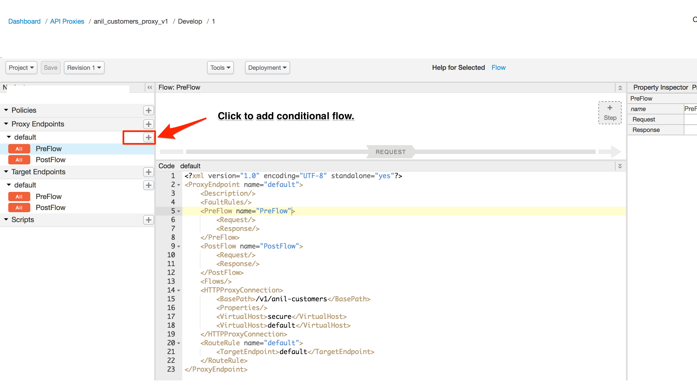
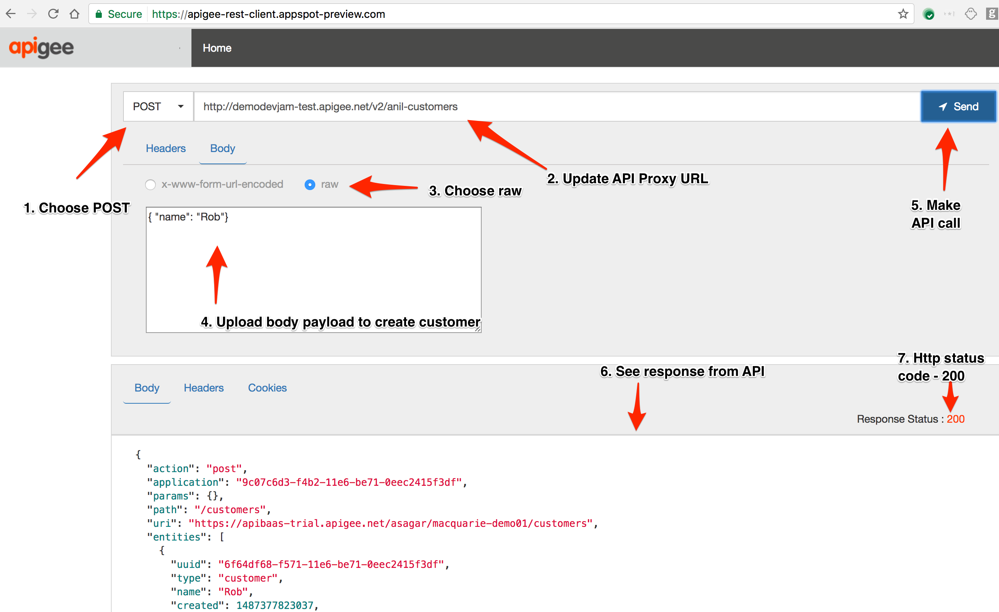

# API Security : Threat Protection

Duration : 30 mins


## Use case

You have a set of APIs that are either consumed by partners or open to public. You want to keep those APIs secure by protecting the backend from SQL Injection and XML threats. 

## How can Apigee Edge help?

Policies like XML/JSON threat protection and Regular Expression protection in Apigee Edge, help you easily protect your backend and minimize attacks on your API against these threats by addressing the vulnerabilities.

For example, the XML Threat Protection policy screens against XML threats by validating messages against an XML schema (.xsd), evaluating message content for specific blacklisted keywords or patterns and detecting corrupt or malformed messages before those messages are parsed. And, the JSON Threat Protection policy minimizes the risk posed by content-level attacks by enabling you to specify limits on various JSON structures, such as arrays and strings.

## Pre-requisites
  - Apigee Edge Account
  - Proxy created in Lab 1: API Development : API Proxy Flows

  
## Business Requirements
  
API Team got a requirement from business team to expose legacy "Customers API" create customer REST API with a new security mechanism that will protect the server from payload related attacks & SQL Injections.

### Given Information :
  
  Backend URL : https://apibaas-trial.apigee.net/asagar/macquarie-demo01/customers

  
### Action Items :

 - Create a reverse pass through proxy with a name **{your_initials}\_customers\_proxy\_v2**
 - Base Path should be **/v2/{your_initials}-customers**
 - Deploy to test environment

### Success Criteria :
  
  - API Call to **https://{ORNAME}-test.apigee.net/v2{your_initials}-customers** should return list of customers.

## Let's do it ! 

- Create a proxy in Apigee Edge UI. Navigate to APIs -> API Proxies
- Click on Create New Proxy button on top right sidebar.
- Use above information & experience you have gained from Apigee Edge DevJam Prerequisites labs that you have done prior to this DevJam.
- Have a question / questions ? Apigee Team is happy to help you. Please ask for help.
  
## Instructions

**Step 1**. Access "{your_initials}_customers_proxy_v2" API Proxy that you have created above. 

Click on APIs -> API Proxies in top navigation menu, Click on "{your_initials}_customers_proxy_v2" API Proxy.

**Step 2** . Click on Develop tab to access proxy development screen.

  
  
**Step 3** : Click on + icon next to Proxy EndPoints -> Defaults to add a conditonal flow to proxy endpoint.

    
  
  
**Step 4** : Add a conditional flow to match create customer API call.

Tip: See image below

      
  
**Step 5** : Save API call  

**Step 6** : Let's make an API Call to "create customer" REST endpoint to see the API in action. Navigate to https://apigee-rest-client.appspot-preview.com/ , Make a post call to create customer.

Tip: Get the proxy endpoint from Overview tab in API proxy. It should be **https://{ORNAME}-test.apigee.net/v2{your_initials}-customers**

    
  
  
**Step 7** : Let's create one more customer with additional metadata & try to flood the system with a large payload. Update the body with below payload & make an API call.

```
{ 
   "name": "Payload Threat Bot 1",
   "First Name": "Attacker",
   "Last Name": "Attacker Again",
  "Alias Name1" : "Attacker Again",
   "First Name2": "Attacker",
   "Last Name2": "Attacker Again",
  "Alias Name2" : "Attacker Again",
   "First Name3": "Attacker",
   "Last Name3": "Attacker Again",
  "Alias Name3" : "Attacker Again",
   "First Name4": "Attacker",
   "Last Name4": "Attacker Again",
  "Alias Name4" : "Attacker Again",
}
```

    

As you can see, Our target API accepts the larger JSON payloads as it is which can flood the system / network that might bring down the target server / slow down same by introducing latencies.

Let's secure our API against payload threats using 'JSON Threat Protection Policy.'

**Step 8**: 

Let's secure our API against payload threats using 'JSON Threat Protection Policy'. We are going to allow only 5 elements in the JSON payload & protect backend service.

Go to Develop tab in API Proxy, Select 'Create Customer' conditional flow, Click on +Step on request flow to add threat protection policy. 

   
  
   
  

**Step 9**:

  
Change the ObjectEntryCount to 5 that will allow max 5 elements in the payload & save the API Proxy.

   

**Step 10** :

Let's verify the API against payload attacks, Navigate to https://apigee-rest-client.appspot-preview.com/ , Add header 'Content-Type' : 'application/json'

   

Update the payload & make the API call,

   


**Step 11** :

Let's make a call with payload size less than or equal to 5 & see the success response.

   

I


