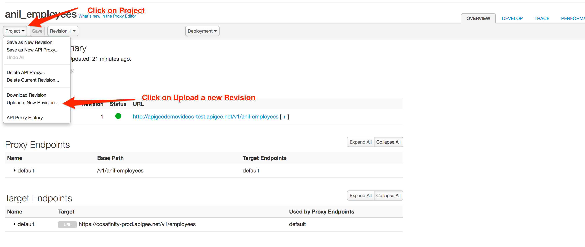
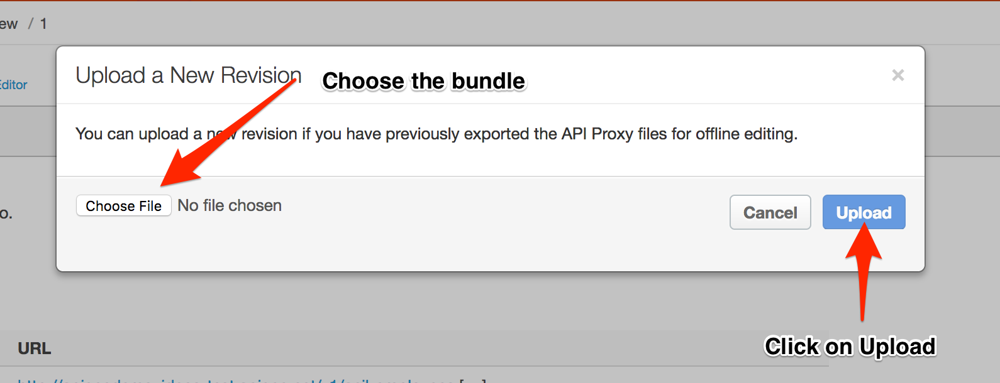
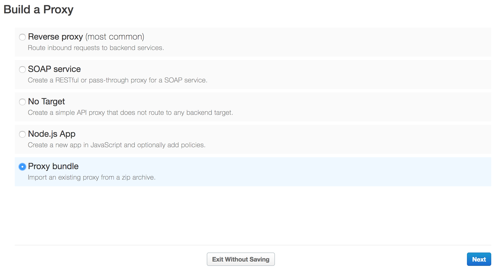
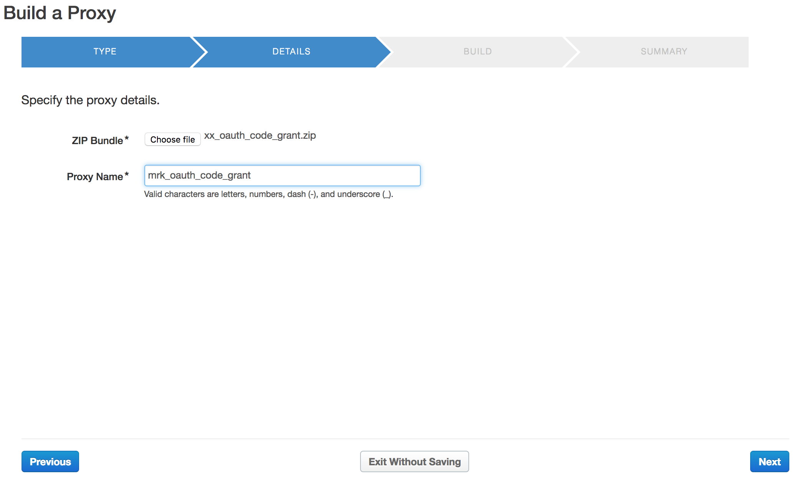
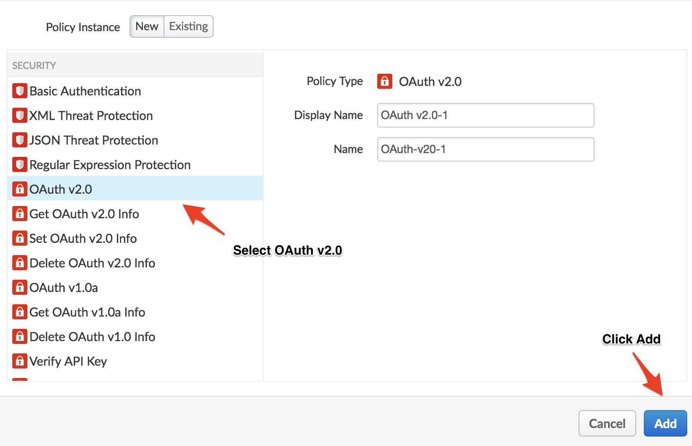
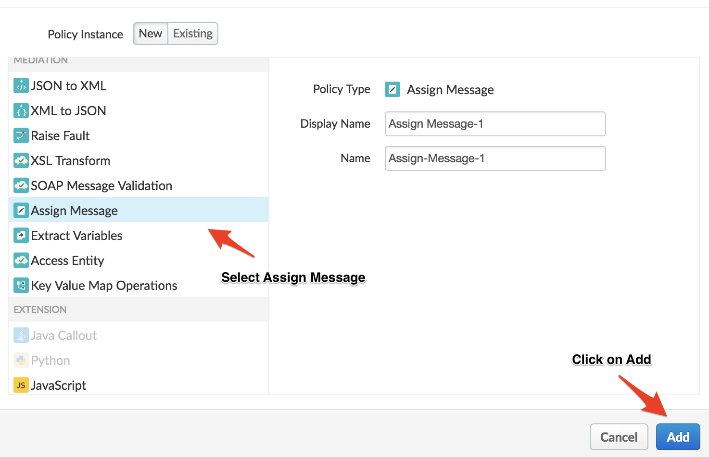
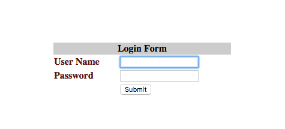
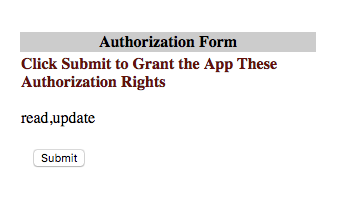
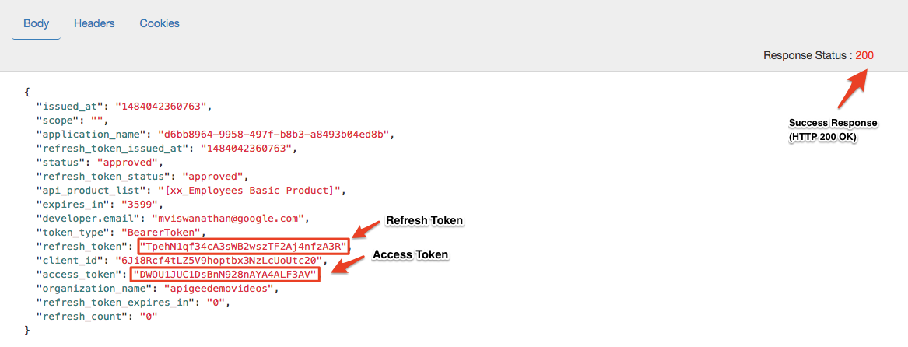

#API Security : Securing APIs with OAuth (3-legged)

*Duration : 30 mins - Persona : API Team/Security*
## Use case

You have a set of APIs that are consumed by trusted partners. You want to secure those APIs using a three legged OAuth (Authorization Code flow).

## How can Apigee Edge help?

Apigee Edge quickly lets you secure your APIs using out of the box OAuth policies. OAuth defines token endpoints, authorization endpoints, and refresh endpoints. Apps call these endpoints to get access tokens, to refresh access tokens, and, in some cases, to get authorization codes. These endpoints refer to specific OAuth 2.0 policies that execute when the endpoint is called.

Authorization code is one of the most commonly used OAuth 2.0 grant types. The authorization code flow is a "three-legged OAuth" configuration. In this configuration, the user authenticates himself with the resource server and gives the app consent to access his protected resources without divulging username/passwords to the client app. This grant type is intended for apps that are written by third-party developers who do not have a trusted business relationship with the API provider. For example, developers who register for public API programs should not generally be trusted. With this grant type, the user's credentials on the resource server are never shared with the app.

## Pre-requisites

* You have the following created on Apigee Edge - an API Product, a Developer and an App.
  
### Let's prepare the proxy for the lab :

 - Let's update the proxy with the downloaded proxy bundle in lab1. Create a new revision & upload the bundle.

  

 - Upload the bundle,

  

 - Deploy to test environment

  

### Success Criteria :
  
  - API Call to **https://{ORNAME}-test.apigee.net/v1/{your_initials}-employees** should return list of employees.


## Instructions

* Go to [https://apigee.com/edge](https://apigee.com/edge) and log in. This is the Edge management UI.

* Select **APIs** > **API Proxies** in the top navigation menu

	

* Download the api proxy bundle from [here](https://drive.google.com/open?id=0B-U60FIlIY3JdTVkNWlFLVIxb2s)

* Click the **+ API Proxy** button

	

* Select **Proxy Bundle **option and click Next.

	

* Now, choose the bundle that you downloaded earlier, rename the proxy in this format **{your_initials}**_oauth_code_grant and click Next and then Build

	

* Click on the API Proxy name.

	

* Click on develop and select default

	

* From the code editor, find the base path entry and update it so that it follows this format

	`/v1/{your_initials}/oauth_ac`

	

* Now Save the proxy and deploy it to test

	

* Once the proxy is deployed, select **Publish > API Products** from the side navigation menu

	

* Select the API Product that you created as a part of "Publishing APIs" lab.

	

* Click on Edit

	

* Now under Resources > API Proxy section, click on Add API Proxy

	

* Select the API Proxy and click save

	

* Now. select **APIs** > **API Proxies** in the top navigation menu

	

* Click on the API proxy that you created in "Creating an API proxy" lab.

* Click on the **Develop** tab. Select **PreFlow** from the sidebar under **Proxy Endpoints** section

	

* Click on Add Step and in the dialog, select OAuth v2.0 from the Security section then click the Add button

	

* Click on the policy and in the code editor, paste the code give below
  	```
	<?xml version="1.0" encoding="UTF-8" standalone="yes"?>
	<OAuthV2 async="false" continueOnError="false" enabled="true" name="OAuth-v20-1">
	    <DisplayName>OAuth v2.0-1</DisplayName>
	    <ExternalAuthorization>false</ExternalAuthorization>
	    <Operation>VerifyAccessToken</Operation>
	    <SupportedGrantTypes/>
	    <GenerateResponse enabled="true"/>
	</OAuthV2>
	```

* Once again click on Add Step and in the dialog, select Assign Message policy from the Mediation section then click the Add button

	

* Click on the policy and in the code editor, paste the code give below

	```
	<?xml version="1.0" encoding="UTF-8" standalone="yes"?>
	<AssignMessage async="false" continueOnError="false" enabled="true" name="Assign-Message-1">
	<DisplayName>Assign Message-1</DisplayName>
	<Remove>
	   <Headers>
	      <Header name="Authorization"/>
	   </Headers>
	</Remove>
	    <IgnoreUnresolvedVariables>true</IgnoreUnresolvedVariables>
	    <AssignTo createNew="false" transport="http" type="request"/>
	</AssignMessage>
	```


**Note**: You’ll have to remove the Authorization header using the Assign Message policy because, the header might create some conflict in the target backend.

* **Save** the proxy and deploy it on the **test** environment

	

* Make sure that you have added these two proxy bundles in your API Product.

* *Congratulations!*...You’ve now successfully secured your APIs with OAuth 2.0

* Now, let’s test it. To do that, we’d have to obtain the consumer key and secret for a particular app that is associated with a API Product containing the APIs that we created.

* Click **Publish** > **Developer Apps** from the side navigation menu

	

* Select the app that you created in the Publishing APIs lab

	

* Click on the show button under Consumer Key, Consumer Secret.

* Copy the values and store them somewhere safe

	

* Mac and Linux users, open Terminal and type the following command

	`echo <consumer_key>:<consumer_secret> | base64`

	Windows and Chromebook users, refer this [link](https://www.base64encode.org/)

* Copy the URL for oauth API proxy.

	

* First, you’ll obtain an auth code which will be exchanged to obtain the access token. To obtain an auth code, you’ll have to call the **/authorize** endpoint with your app’s client id, a code response type and required scopes as query params

	`Query param: response_type=code, client_id=<your app’s client id>,
	scope=READ,UPDATE`

	The final URL will look something like this -

	[http://apigeedemovideos-test.apigee.com/v1/mrk/oauth_ac/authorize?client_id=<client_id>&response_type=code&scope=READ,UPDATE](http://apigeedemovideos-test.apigee.com/v1/mrk/oauth_ac/authorize?client_id=)

* Make a call to this URL from your browser, it will then redirect you to a login page which will look like this.

	

	Use these details to login

	```
	User Name: test
	Password: password
	```

* After you’re logged in, you should be able to see the consent page asking you to authorize the permissions

	

	Click on the submit button

* You will be redirected to the callback URL that you provided while creating the app with a query parameter i.e, code.

* To obtain an access token, we need to call the `/token` endpoint with the following

	body information passed in the **x-www-form-url-encoded** format

	```
	code : <auth code>
	grant_type : authorization_code
	client_id : <app’s client_id>
	client_secret : <app’s client_secret>
	```

* Now, let’s use the REST Client ([https://apigee-rest-client.appspot-preview.com/](https://apigee-rest-client.appspot-preview.com/)) to obtain an access token. Open the REST Client on a new browser window.  

* Paste the URL with the /token endpoint, select POST and then fill up the body

	

* Hit **Send** and you should see a response like this below. Then, copy the value for access token, refresh token and save them.

	

* Now, you should be able to get the employees list using the access token that we just obtained. Copy the URL for the proxy you created earlier in this lab.

	

* Paste the URL in the Rest client and add the Authorization header. The value for Authorization header will be the access token that we obtained previously.

	`Authorization: Bearer <access_token>`

	

* Hit **Send** and you should see a response like this below.

	

* And, if you remove the Authorization header and hit send, you will see a 401 Unauthorized status.

	

## Lab Video

You can watch this short video to see how to implement 3 legged OAuth on Apigee Edge. [https://youtu.be/vPryGej4ydg](https://youtu.be/vPryGej4ydg)

## Earn Extra-points

Now that you’ve learned how to secure your API with OAuth 2.0, try to implement a refresh token flow which will give you an access token based in exchange for the refresh token.

## Quiz

1. How do you revoke an access token?

2. Explain how apigee edge lets you integrate with an external IdP?

## Summary

In this lab you learned how to secure your API using a three legged OAuth, obtaining an auth code, exchanging it for an access code and using that against your API.

## References

* Link to Apigee docs page

    * OAuth 2.0: Configuring a new API proxy [http://docs.apigee.com/api-services/content/understanding-default-oauth-20-configuration ](http://docs.apigee.com/api-services/content/understanding-default-oauth-20-configuration)

    * Secure an API with OAuth - Authorization Grant Type [http://docs.apigee.com/api-services/content/oauth-v2-policy-authorization-code-grant-type](http://docs.apigee.com/api-services/content/oauth-v2-policy-authorization-code-grant-type)

* [Link](https://community.apigee.com/topics/oauth+2.0.html) to Community posts and articles with topic as "OAuth 2.0"

* Search and Revoke tokens - [https://community.apigee.com/articles/1571/how-to-enable-oauth-20-token-search-and-revocation.html](https://community.apigee.com/articles/1571/how-to-enable-oauth-20-token-search-and-revocation.html)

## Rate this lab

How did you link this lab? Rate [here](https://drive.google.com/open?id=19YS_51mBsilVeb3FUhEGs8E6GaMhtoKJf7dulp0oUq0).
